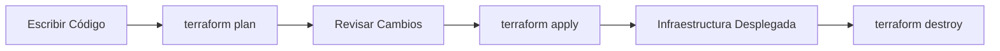

# SQL Server en Linux con Proxmox VE y Terraform

Esta configuración de Terraform automatiza el despliegue de SQL Server en Linux usando un entorno Proxmox VE para el proyecto TheSkibiditeca.

## 📋 Índice

- [¿Qué es Terraform?](#qué-es-terraform)
- [Arquitectura del Despliegue](#arquitectura-del-despliegue)
- [Prerequisitos](#prerequisitos)
- [Instalación y Configuración](#instalación-y-configuración)
- [Uso](#uso)
- [Arquitectura de Archivos](#arquitectura-de-archivos)
- [Personalización](#personalización)
- [Troubleshooting](#troubleshooting)
- [Seguridad](#seguridad)

## 🤔 ¿Qué es Terraform?

**Terraform** es una herramienta de **Infrastructure as Code (IaC)** desarrollada por HashiCorp que permite:

### ✨ Características Principales

- **Declarativo**: Describes el estado deseado, no los pasos para llegar ahí
- **Multi-proveedor**: Soporta AWS, Azure, GCP, Proxmox, VMware, etc.
- **Idempotente**: Ejecutar múltiples veces produce el mismo resultado
- **Plan y Apply**: Previsualiza cambios antes de aplicarlos
- **State Management**: Mantiene el estado actual de la infraestructura
- **Versionado**: La infraestructura se versiona como código

### 🔄 Flujo de Trabajo



1. **Write**: Escribes configuración en archivos `.tf`
2. **Plan**: `terraform plan` muestra qué va a cambiar
3. **Apply**: `terraform apply` ejecuta los cambios
4. **Manage**: Terraform mantiene el estado en `.tfstate`

## 🏗️ Arquitectura del Despliegue

```
┌─────────────────────────────────────┐
│           Proxmox VE Host           │
├─────────────────────────────────────┤
│  ┌─────────────────────────────┐    │
│  │     SQL Server VM           │    │
│  │                             │    │
│  │  • Ubuntu 20.04 LTS         │    │
│  │  • SQL Server 2022 Linux    │    │
│  │  • 4 CPU / 4GB RAM          │    │
│  │  • 50GB Disk                │    │
│  │  • IP: 192.168.1.50         │    │
│  │                             │    │
│  │  Puertos:                   │    │
│  │  • 1433 - SQL Server        │    │
│  │  • 22   - SSH               │    │
│  └─────────────────────────────┘    │
└─────────────────────────────────────┘
```

## 📋 Prerequisitos

### 🖥️ Proxmox VE

- Proxmox VE 7.0+ instalado y configurado
- Template de Ubuntu 20.04+ o Debian 11+ preparado
- Usuario con permisos para crear VMs
- Red configurada con IPs disponibles

### 🛠️ Template Requirements

El template de Linux debe tener:

```bash
# Cloud-init configurado
# QEMU Guest Agent instalado
# SSH habilitado y configurado
# Usuario con sudo (ubuntu, debian, etc.)
# Python 3.6+ instalado
```

### 💻 Máquina Local

- Terraform 1.0+ instalado
- Git configurado
- Acceso de red a Proxmox VE

## 🚀 Instalación y Configuración

### 1️⃣ Instalar Terraform

```bash
# Windows (usando Chocolatey)
choco install terraform

# Windows (usando Scoop)
scoop install terraform

# Linux (Ubuntu/Debian)
curl -fsSL https://apt.releases.hashicorp.com/gpg | sudo apt-key add -
sudo apt-add-repository "deb [arch=amd64] https://apt.releases.hashicorp.com $(lsb_release -cs) main"
sudo apt-get update && sudo apt-get install terraform

# macOS (usando Homebrew)
brew install terraform
```

### 2️⃣ Clonar el Repositorio

```bash
git clone <repository-url>
cd TheSkibiditeca/TheSkibiditeca.Infra/terraform/sql-server
```

### 3️⃣ Configurar Variables

```bash
# Copiar archivo de ejemplo
cp terraform.tfvars.example terraform.tfvars

# Editar con sus valores
nano terraform.tfvars
```

### 4️⃣ Ejemplo de terraform.tfvars

```hcl
# Proxmox Configuration
proxmox_api_url = "https://192.168.1.100:8006/api2/json"
proxmox_user = "root@pam"
proxmox_password = "su-password-seguro"

# VM Configuration
vm_target_node = "pve-node1"
vm_template = "ubuntu-20.04-server-template"
vm_ip_address = "192.168.1.50"
vm_gateway = "192.168.1.1"

# SQL Server Configuration
sql_sa_password = "MiPasswordSuperSeguro123!"
```

## 🎯 Uso

### 🔄 Comandos Básicos

```bash
# 1. Inicializar Terraform (solo la primera vez)
terraform init

# 2. Validar configuración
terraform validate

# 3. Formatear código
terraform fmt

# 4. Ver plan de ejecución
terraform plan

# 5. Aplicar configuración
terraform apply

# 6. Ver outputs
terraform output

# 7. Destruir infraestructura
terraform destroy
```

### 📊 Proceso Detallado

#### Paso 1: Inicialización
```bash
terraform init
```
- Descarga providers (proxmox, null)
- Configura backend
- Prepara directorio de trabajo

#### Paso 2: Planificación
```bash
terraform plan -var-file="terraform.tfvars"
```
- Muestra qué recursos se crearán
- Valida configuración
- No realiza cambios

#### Paso 3: Aplicación
```bash
terraform apply -var-file="terraform.tfvars"
```
- Crea la VM en Proxmox
- Instala SQL Server en Linux
- Configura firewall (UFW/iptables)
- Crea base de datos

#### Paso 4: Verificación
```bash
terraform output
```
- Muestra información de conexión
- Cadenas de conexión
- IPs y puertos

## 📁 Arquitectura de Archivos

```
sql-server/
├── providers.tf              # Configuración de providers
├── variables.tf               # Definición de variables
├── main.tf                   # Recursos principales
├── outputs.tf                # Outputs del despliegue
├── terraform.tfvars.example  # Ejemplo de variables
├── .gitignore                # Archivos a ignorar
├── README.md                 # Esta documentación
└── scripts/
    ├── install-sql-server.ps1    # Instalación SQL Server
    └── configure-firewall.ps1    # Configuración firewall
```

### 🔧 Descripción de Archivos

| Archivo | Propósito |
|---------|-----------|
| `providers.tf` | Define providers (Proxmox, null) y versiones |
| `variables.tf` | Declara todas las variables con validaciones |
| `main.tf` | Recursos principales (VM, instalación) |
| `outputs.tf` | Información de salida (IPs, conexiones) |
| `scripts/` | Scripts PowerShell para configuración |

## ⚙️ Personalización

### 🔧 Cambiar Recursos de Hardware

```hcl
# En terraform.tfvars
vm_cores = 8          # Más CPU
vm_memory = 16384     # Más RAM (16GB)
vm_disk_size = "200G" # Más almacenamiento
```

### 🌐 Configurar Red Diferente

```hcl
vm_ip_address = "10.0.0.50"
vm_gateway = "10.0.0.1"
vm_network_mask = 24
vm_network_bridge = "vmbr1"
```

### 🗄️ Versión de SQL Server

```hcl
sql_server_version = "2019"  # o "2022"
```

### 📝 Variables Importantes

| Variable | Descripción | Ejemplo |
|----------|-------------|---------|
| `proxmox_api_url` | URL API Proxmox | `https://192.168.1.100:8006/api2/json` |
| `vm_target_node` | Nodo Proxmox | `pve-node1` |
| `vm_template` | Template Linux | `ubuntu-20.04-server-template` |
| `vm_ip_address` | IP de la VM | `192.168.1.50` |
| `sql_sa_password` | Password SA | `MiPassword123!` |

## 🐛 Troubleshooting

### ❌ Errores Comunes

#### Error: Template no encontrado
```
Error: template 'windows-server-2022-template' not found
```
**Solución**: Verificar que el template existe en Proxmox
```bash
pvesh get /nodes/NODE/qemu
```

#### Error: IP en uso
```
Error: IP address already in use
```
**Solución**: Cambiar la IP en `terraform.tfvars`

#### Error: Credenciales incorrectas
```
Error: authentication failed
```
**Solución**: Verificar usuario y contraseña de Proxmox

### 🔍 Debug y Logs

```bash
# Habilitar logs detallados
export TF_LOG=DEBUG
terraform apply

# Logs de Proxmox provider
cat terraform-plugin-proxmox.log

# Logs de instalación en la VM
# Conectarse via RDP y revisar:
# C:\sql-server-installation.log
```

### 🔧 Comandos de Verificación

```bash
# Conectar via SSH
ssh ubuntu@192.168.1.50

# Probar SQL Server
sqlcmd -S 192.168.1.50 -U sa -P "Password123!"
```

## 🔒 Seguridad

### 🛡️ Mejores Prácticas

#### 1. Contraseñas Seguras
```hcl
# Requisitos mínimos para SQL Server:
# - 8 caracteres mínimo
# - Mayúsculas y minúsculas
# - Números y símbolos
sql_sa_password = "MyStr0ng_P@ssw0rd!"
```

#### 2. Firewall de Red
```bash
# Configurar firewall adicional en Proxmox/Router
# Solo permitir acceso desde redes conocidas
iptables -A INPUT -s 192.168.1.0/24 -p tcp --dport 1433 -j ACCEPT
```

#### 3. Autenticación SSH por Clave
```bash
# Generar clave SSH
ssh-keygen -t ed25519

# Copiar clave al servidor
ssh-copy-id ubuntu@192.168.1.50

# Deshabilitar autenticación por contraseña
sudo nano /etc/ssh/sshd_config
# PasswordAuthentication no
```

#### 4. Usuarios y Permisos
```sql
-- Crear usuario específico para la aplicación
CREATE LOGIN [TheSkibiditecaApp] WITH PASSWORD = 'AppPassword123!'
CREATE USER [TheSkibiditecaApp] FOR LOGIN [TheSkibiditecaApp]
ALTER ROLE db_datareader ADD MEMBER [TheSkibiditecaApp]
ALTER ROLE db_datawriter ADD MEMBER [TheSkibiditecaApp]
```

#### 5. Backup y Recovery
```sql
-- Configurar backups automáticos
EXEC sp_add_job @job_name = 'Backup TheSkibiditeca'
-- Configurar punto de recuperación
ALTER DATABASE [TheSkibiditeca] SET RECOVERY FULL
```

### 🔐 Hardening de Seguridad

```bash
# En la VM Linux, ejecutar después del despliegue:

# 1. Actualizar sistema
sudo apt update && sudo apt upgrade -y

# 2. Configurar fail2ban
sudo apt install fail2ban -y
sudo systemctl enable fail2ban

# 3. Configurar SQL Server SSL
sudo /opt/mssql/bin/mssql-conf set network.forceencryption 1

# 4. Configurar firewall restrictivo
sudo ufw default deny incoming
sudo ufw default allow outgoing
sudo ufw allow ssh
sudo ufw allow 1433/tcp
sudo ufw enable

# 5. Configurar logrotate para SQL Server
sudo nano /etc/logrotate.d/mssql-server
```

## 📚 Referencias

- [Terraform Documentation](https://www.terraform.io/docs)
- [Proxmox VE API](https://pve.proxmox.com/pve-docs/api-viewer/)
- [SQL Server Documentation](https://docs.microsoft.com/en-us/sql/)
- [Terraform Proxmox Provider](https://registry.terraform.io/providers/Telmate/proxmox/latest/docs)

## 📞 Soporte

Para problemas específicos del proyecto:
1. Revisar logs en `terraform-plugin-proxmox.log`
2. Verificar configuración de red y Proxmox
3. Consultar documentación de Terraform y Proxmox
4. Crear issue en el repositorio del proyecto

---

*Copyright (c) dominuxLABS. All rights reserved.*
